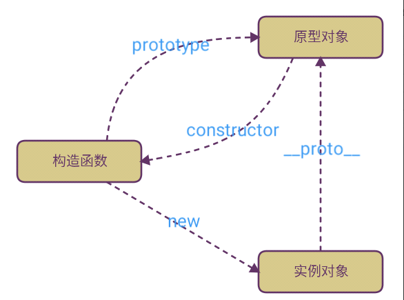
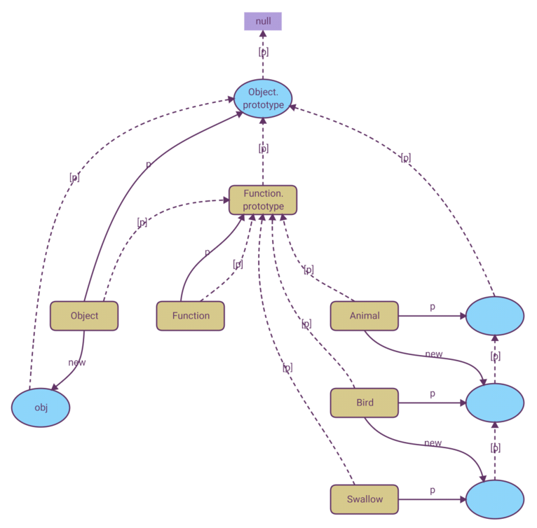

1. 原型链相关的概念
   原型链是一种机制，指的是 JavaScript 每个对象都有一个内置的 __proto__ 属性指向创建它的构造函数的 prototype（原型）属性。原型链的作用是为了实现对象的继承，要理解原型链，需要先从函数对象、constructor、new、prototype、__proto__ 这五个概念入手
2. 函数对象
   - 普通对象
    ```javascript
    var o1 = {};
    var o2 = new Object();
    ```
    - 函数对象
    ```javascript
    function f1() {

    }
    var f2 = function() {};
    var f3 = new Function('str', 'console.log(str)')
    ```
  - 简单的说，凡是使用 function 关键字或 Function 构造函数创建的对象都是函数对象。而且，只有函数对象才拥有 prototype （原型）属性。
3. 构造函数constructor
   ```javascript
   function Person(name, age, job){
      this.name = name;
      this.age = age;
      this.job = job;
      this.sayName = function(){
          console.log(this.name);
      };
    }

    var person1 = new Person("Stone", 28, "Software Engineer");
    var person2 = new Person("Sophie", 29, "English Teacher");
   ```
   - 构造函数本身也是函数，只不过可以用来创建对象而已。
4. new 操作符
  
    要创建Person的实例，必须要使用new操作符
   - 使用new操作符调用构造函数会经历以下四个步骤
     - 创建一个新对象；
     - 将构造函数的作用域赋给新对象（因此 this 就指向了这个新对象）；
     - 执行构造函数中的代码（为这个新对象添加属性）；
     - 返回新对象。


      ```javascript
      // construct: 构造函数
      function newFunction() {
        // 通过Object.create创建一个空对象；
        var res = Object.create(null);
        // 排除第一个构造函数参数
        var construct = Array.prototype.shift.call(arguments);
        res.__proto__ = construct.prototype;
        // 使用apply执行构造函数，将构造函数的属性挂载在res上面
        var conRes = construct.apply(res, arguments);
        // 判断返回类型
        return conRes instanceof Object ? conRes : res;
      }
      ```

5. 构造函数与普通函数的区别
   - 构造函数与其他函数的唯一区别，就在于调用它们的方式不同，构造函数也可以当做普通函数使用
   ```javascript
   // 当作构造函数使用
    var person = new Person("Stone", 28, "Software Engineer");
    person.sayName(); // "Stone"

    // 作为普通函数调用
    Person("Sophie", 29, "English Teacher"); // 添加到 window
    window.sayName(); // "Sophie"

    // 在另一个对象的作用域中调用
    var o = new Object();
    Person.call(o, "Tommy", 3, "Baby");
    o.sayName(); // "Tommy"
   ```
   - 构造函数的缺点
     - 使用构造函数的主要问题，就是每个方法都要在每个实例上重新创建一遍。在前面的例子中，person1 和 person2 都有一个名为 sayName() 的方法，但那两个方法不是同一个 Function 的实例，每个 Person 实例都包含一个不同的 Function 实例（sayName() 方法）
     - 把函数定义转移到构造函数外部来解决上述问题
      ```javascript
      function Person(name, age, job){
          this.name = name;
          this.age = age;
          this.job = job;
          this.sayName = sayName;
      }

      function sayName(){
          console.log(this.name);
      }

      var person1 = new Person("Stone", 28, "Software Engineer");
      var person2 = new Person("Sophie", 29, "English Teacher");
      ```
      这样做确实解决了两个函数做同一件事的问题，可是新问题又来了，在全局作用域中定义的函数实际上只能被某个对象调用，这让全局作用域有点名不副实。而更让人无法接受的是，如果对象需要定义很多方法，那么就要定义很多个全局函数，于是我们这个自定义的引用类型就丝毫没有封装性可言了。好在，这些问题可以通过使用原型来解决。

6. prototype原型 
   ```javascript
   function Person(){}

    Person.prototype.name = "Stone";
    Person.prototype.age = 28;
    Person.prototype.job = "Software Engineer";
    Person.prototype.sayName = function(){
        console.log(this.name);
    };

    var person1 = new Person();
    person1.sayName();   // "Stone"

    var person2 = new Person();
    person2.sayName();   // "Stone"

    console.log(person1.sayName == person2.sayName);  // true
   ```

   我们将 sayName() 方法和所有属性直接添加到了 Person 的 prototype 属性中，构造函数变成了空函数。即使如此，也仍然可以通过调用构造函数来创建新对象，而且新对象还会具有相同的属性和方法。但与前面的例子不同的是，新对象的这些属性和方法是由所有实例共享的。换句话说，person1 和 person2 访问的都是同一组属性和同一个 sayName() 函数。

   - 理解原型对象

      在默认情况下，所有原型对象都会自动获得一个 constructor（构造函数）属性，这个属性包含一个指向 prototype 属性所在函数的指针。就拿前面的例子来说，Person.prototype.constructor 指向 Person

      当为对象实例添加一个属性时，这个属性就会屏蔽原型中保存的同名属性；换句话说，添加这个属性只会阻止我们访问原型中的那个属性，但不会修改那个属性。即使将这个属性设置为 null ，也只会在实例中设置这个属性，而不会恢复其指向原型的连接。不过，使用 delete 操作符则可以完全删除实例属性，从而让我们能够重新访问原型中的属性，如下所示。

      ```javascript
      function Person(){}

      Person.prototype.name = "Stone";
      Person.prototype.age = 28;
      Person.prototype.job = "Software Engineer";
      Person.prototype.sayName = function(){
          console.log(this.name);
      };

      var person1 = new Person();
      var person2 = new Person();

      person1.name = "Sophie";
      console.log(person1.name);     // "Sophie"，来自实例
      console.log(person2.name);     // "Stone"，来自原型

      delete person1.name;
      console.log(person1.name);     // "Stone"，来自原型
      ```

     - 更简单的原型语法

      ```javascript
      function Person(){}

      Person.prototype = {
          name : "Stone",
          age : 28,
          job: "Software Engineer",
          sayName : function () {
              console.log(this.name);
          }
      };
      ```
      这种方法最终结果相同，但是constructor属性不再指向Person了，因为本质上是重写了默认的Prototype对象，因此 constructor 属性也就变成了新对象的 constructor 属性（指向 Object 构造函数），不再指向 Person 函数

      ```javascript
        var friend = new Person();

        console.log(friend instanceof Object);        // true
        console.log(friend instanceof Person);        // true
        console.log(friend.constructor === Person);    // false
        console.log(friend.constructor === Object);    // true
      ```

      手动将constructor设置成合适的值

      ```javascript
      function Person(){}

      Person.prototype = {
          constructor : Person,
          name : "Stone",
          age : 28,
          job: "Software Engineer",
          sayName : function () {
              console.log(this.name);
          }
      };
  
      ```

      ```javascript
      function Person(){}

      Person.prototype = {
          name : "Stone",
          age : 28,
          job : "Software Engineer",
          sayName : function () {
              console.log(this.name);
          }
      }; 

      // 重设构造函数，只适用于 ECMAScript 5 兼容的浏览器
      Object.defineProperty(Person.prototype, "constructor", {
          enumerable: false,
          value: Person
      });
      ```

  - 原型的动态性
    由于在原型中查找值的过程是一次搜索，因此我们对原型对象所做的任何修改都能够立即从实例上反映出来，即使是先创建了实例后修改原型也照样如此

    ```javascript
    var friend = new Person();

    Person.prototype.sayHi = function(){
        console.log("hi");
    };

    friend.sayHi();   // "hi"（没有问题！）
    ```

    但如果是重写整个原型对象，那么情况就不一样了。我们知道，调用构造函数时会为实例添加一个指向最初原型的 [[Prototype]] 指针，而把原型修改为另外一个对象就等于切断了构造函数与最初原型之间的联系,请记住：实例中的指针仅指向原型，而不指向构造函数。

    ```javascript
    function Person(){}

    var friend = new Person();

    Person.prototype = {
        constructor: Person,
        name : "Stone",
        age : 28,
        job : "Software Engineer",
        sayName : function () {
            console.log(this.name);
        }
    };

    friend.sayName();   // Uncaught TypeError: friend.sayName is not a function
    ```

    在这个例子中，我们先创建了 Person 的一个实例，然后又重写了其原型对象。然后在调用 friend.sayName() 时发生了错误，因为 friend 指向的是重写前的原型对象，其中并不包含以该名字命名的属性。

    - 原生对象的原型

    ```javascript
    console.log(typeof Array.prototype.sort);       // "function"
    console.log(typeof String.prototype.substring); // "function"
    ```

    给基本类型添加方法

    ```javascript
    String.prototype.startsWith = function (text) {
      return this.indexOf(text) === 0;
    };

    var msg = "Hello world!";
    console.log(msg.startsWith("Hello"));   // true
    ```

    尽管可以这样做，但我们不推荐在产品化的程序中修改原生对象的原型。如果因某个实现中缺少某个方法，就在原生对象的原型中添加这个方法，那么当在另一个支持该方法的实现中运行代码时，就可能会导致命名冲突。而且，这样做也可能会意外地重写原生方法。

    - 原型对象的问题
      - 首先，它省略了为构造函数传递初始化参数这一环节，结果所有实例在默认情况下都将取得相同的属性值。
      - 第二， 原型模式的最大问题是由其共享的本性所导致的。
    ```javascript
    function Person(){}

    Person.prototype = {
        constructor: Person,
        name : "Stone",
        age : 28,
        job : "Software Engineer",
        friends : ["ZhangSan", "LiSi"],
        sayName : function () {
            console.log(this.name);
        }
    };

    var person1 = new Person();
    var person2 = new Person();

    person1.friends.push("WangWu");

    console.log(person1.friends);    // "ZhangSan,LiSi,WangWu"
    console.log(person2.friends);    // "ZhangSan,LiSi,WangWu"
    console.log(person1.friends === person2.friends);  // true
    ```

    - 构造函数与原型对象相结合的方法

    构造函数用于定义实例属性，而原型用于定义方法和共享的属性。结果，每个实例都会有自己的一份实例属性的副本，但同时又共享着对方法的引用，最大限度地节省了内存

    ```javascript
    function Person(name, age, job){
      this.name = name;
      this.age = age;
      this.job = job;
      this.friends = ["ZhangSan", "LiSi"];
    }

    Person.prototype = {
        constructor : Person,
        sayName : function(){
            console.log(this.name);
        }
    }

    var person1 = new Person("Stone", 28, "Software Engineer");
    var person2 = new Person("Sophie", 29, "English Teacher");

    person1.friends.push("WangWu");
    console.log(person1.friends);    // "ZhangSan,LiSi,WangWu"
    console.log(person2.friends);    // "ZhangSan,LiSi"
    console.log(person1.friends === person2.friends);    // false
    console.log(person1.sayName === person2.sayName);    // true
    ```

7. __proto__

当调用构造函数创建一个新实例后，该实例的内部将包含一个指针 __proto__，指向构造函数的原型

```javascript
function Person(){}
var person = new Person();
console.log(person.__proto__ === Person.prototype); // true
```
8. 原型链




```javascript

function Father(){
    this.value = true;
}
Father.prototype.getValue = function(){
    return this.value;
};

function Son(){
    this.value2 = false;
}

// 继承了 Father
Son.prototype = new Father();

Son.prototype.getValue2 = function (){
    return this.value2;
};

var son = new Son();
console.log(son.getValue());  // true
```




参考文献
[javascript闯关记-原型与原型链](https://juejin.im/post/585953a5128fe10069b5f06b)

[javascript中模拟实现new](https://blog.csdn.net/liwenfei123/article/details/80580883)